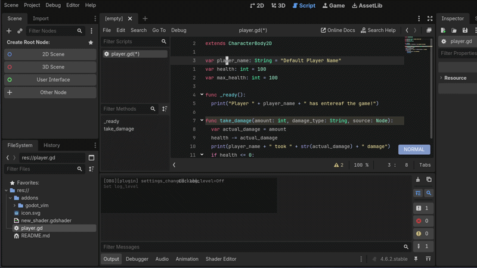
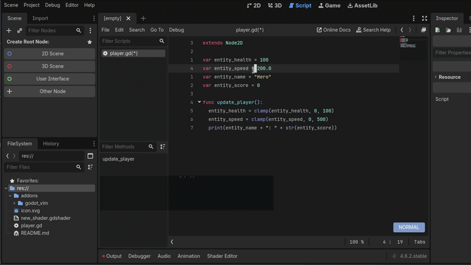
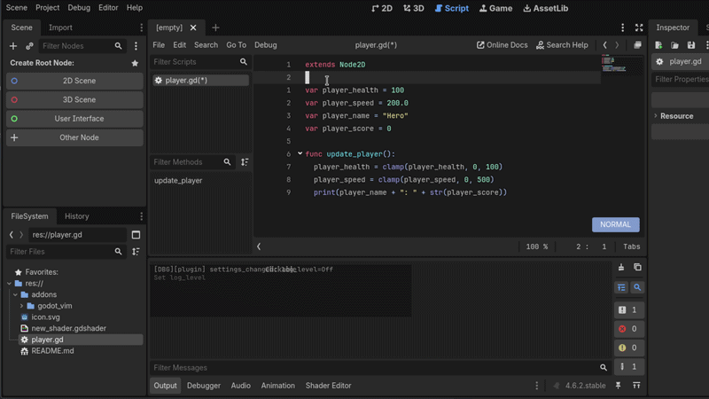
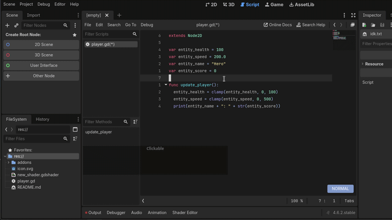

<p align="center">
  
</p>

<h1 align="center">GodotVim</h1>

<p align="center">
  <b>Vim emulation for Godot's built-in script editor.</b>
</p>

<p align="center">
  
  <a href="https://store.godotengine.org/asset/hmdfrds/godotvim/">
    
  </a>
  <a href="https://github.com/hmdfrds/godot-vim/actions/workflows/ci.yml">
    
  </a>
  
</p>

<p align="center">
  
</p>

---

GodotVim runs a real Vim engine inside Godot's script editor. Operators compose
with motions and text objects, `.` repeats, macros record and replay. The same
keystrokes also drive the scene tree, the FileSystem dock, the debugger and the
completion popup, and every one of those keys outside the text buffer is
rebindable from a config file.

## Requirements

| | |
|---|---|
| Godot | 4.5 or newer |
| Editor | Godot's own script editor. It has no effect in Rider, VS Code or any other external editor. |
| Prebuilt binaries | Linux x86_64, Windows x86_64, macOS universal (Intel and Apple Silicon) |
| Needs a source build | Linux arm64, and any Linux with glibc older than 2.34 (Ubuntu 20.04, Debian 11, RHEL 8) |
| Not supported | Windows on ARM |

On Godot 4.5 there is one degradation: `d` and `r` in the FileSystem dock
delegate to an `EditorSettings` API that Godot added in 4.6, so on 4.5 those two
keys do nothing and the plugin prints a warning at startup. Everything else,
`gd` and `K` included, works on 4.5.

## Installation

### From the Godot asset library

1. In your project, open the asset library tab and search for **GodotVim**. The
   listing is at
   [store.godotengine.org/asset/hmdfrds/godotvim](https://store.godotengine.org/asset/hmdfrds/godotvim/).
2. **Download**, then **Install** with **Ignore asset root** left checked.
   Unchecking it puts the files in the wrong place.
3. **Project > Project Settings > Plugins**, enable **GodotVim**.
4. Restart the editor.

### From a release zip

1. Download `godot-vim-vX.Y.Z.zip` from the
   [releases page](https://github.com/hmdfrds/godot-vim/releases/latest).
2. Extract it. The folder inside contains `addons/` and nothing else. `LICENSE`,
   `README.md`, `docs/` and `.godot-vimrc.sample` all live inside
   `addons/godot_vim/`, so installing the addon cannot overwrite anything in
   your project root.
3. Copy `addons/godot_vim/` into your project, giving
   `<your-project>/addons/godot_vim/`.
4. **Project > Project Settings > Plugins**, enable **GodotVim**.
5. Restart the editor.

Every release also publishes a `.sha256` beside each binary, a CycloneDX SBOM, a
VirusTotal scan result and a GitHub build provenance attestation.

## Quick start

Open any script. The caret turns into a block and a mode indicator appears at the
bottom right of the editor. That indicator is how you know the plugin is running.

| Keys | What happens |
|------|--------------|
| `i` | Enter Insert mode |
| `Escape` | Return to Normal mode |
| `dd` | Delete the current line |
| `ci"` | Change the text inside quotes |
| `/pattern` | Search forward |
| `:w` | Save the file |
| `:run` | Run the project (F5) |
| `Ctrl+h/j/k/l` | Move focus between Godot panels |

Nothing needs configuring; the plugin works with no config file at all. When you
do want one, `:mkvimrc` writes `res://.godot-vimrc` with all 20 built-in presets
listed and commented out, and `:mappings` opens a dialog that edits the same file
for you.

## Features

### The full Vim grammar

```
[count] [register] operator [count] motion/textobject
```

`d2w`, `ci"`, `gUiw`, `>ap`. Operators compose with motions and text objects the
way they do in Vim. Counts multiply, registers route the output, and `.` repeats
the last edit, including multi-key operator sequences.

Text objects include `iw`/`aw`, `ip`/`ap`, the quote and bracket pairs, and the
aggregate objects `ib` (tightest enclosing bracket, `<>` included), `iq` (any
quote), `ii` (indent level), `im` (symbol) and `ie` (entire buffer). Visual block
supports `I` and `A`. Surround is built in: `ys{motion}{char}`, `ds{char}`,
`cs{old}{new}`. For multiple cursors, `gb` adds one at the next match of the word
under the cursor, `gB` at the previous, `gs` skips one, and carets you added with
the mouse are imported before each keystroke, so Godot's multi-caret editing and
Vim's stay in sync. The status bar shows the count, for example
`NORMAL (3 cursors)`.

[Motions](docs/REFERENCE.md#motions) ·
[Operators](docs/REFERENCE.md#operators) ·
[Text objects](docs/REFERENCE.md#text-objects) ·
[Registers and macros](docs/REFERENCE.md#registers-and-macros)

### Built for Godot

- **`:run`** and **`:runcurrent`** launch scenes, **`:stop`** stops them
- **`:GodotBreakpoint`** toggles a breakpoint, **`:next`** and **`:stepin`** step
- **`Ctrl+h/j/k/l`** moves focus between the script editor, scene tree, inspector and FileSystem dock. From inside a dock, **`Escape`** returns focus to the editor.
- **`h/j/k/l`** navigate a focused dock, **`/`** jumps to its search box
- **FileSystem dock**: `a` create file or directory, `d` delete, `r` rename, `y` yank path, `R` refresh
- **Debugger dock**: `J` and `K` walk stack frames and breakpoints, `G` jumps to the deepest frame, `y` yanks the row
- **`gd`** goes to a definition, **`K`** opens Godot's documentation tooltip for the symbol under the cursor
- **`Ctrl-N`**, **`Ctrl-P`** and **`Ctrl-Space`** drive the completion popup
- **`Ctrl-O`** and **`Ctrl-I`** follow the jump list across tabs, not just inside one file
- **`Ctrl-W h/j/k/l`** and **`Ctrl-W w`** move and cycle focus from the script editor
- **`:zen`** toggles distraction-free mode

All 30 of the panel, dock, FileSystem, debugger, searchbox and completion
bindings ship as config lines rather than hardcoded match arms, so `panelunmap`
and `panelmap` in your `.godot-vimrc` replace any of them. `:panelmap` prints
every live binding in the exact syntax you would paste back into a vimrc.

[All Godot commands](docs/REFERENCE.md#custom-commands) ·
[Panel key bindings](docs/REFERENCE.md#panel-key-bindings-panelmap)

<p align="center">
  
  <br><em>Ctrl+h/j/k/l between docks, then Vim keys inside them</em>
</p>

<p align="center">
  
  <br><em>K for the documentation tooltip, gd for go-to-definition</em>
</p>

### Search, replace and history

Search is incremental, and `:s/old/new/g` highlights every match region in yellow
while you are still typing the pattern, so you see what will change before
pressing Enter. Set **Inccommand** to `off` if you would rather not have the
preview. `:g`, `:v`, `:norm`, `:sort`, `:retab` and `:center` are all available.

Undo is a tree, not a line: `:undolist` lists the branches, `:undotree` draws
one, `g-` and `g+` walk it, and `:earlier` and `:later` take a count, a time
(`10s`, `5m`, `1h`) or a save point (`1f`). Folds respond to `zo`, `zc`, `za`,
`zM` and `zR`. Marks are local and global, and `:marks`, `:jumps`, `:changes`,
`:reg` and `:messages` show the current state.

[Ex commands](docs/REFERENCE.md#standard-ex-commands) ·
[Undo tree](docs/REFERENCE.md#undo-tree) ·
[Folds](docs/REFERENCE.md#fold-commands)

<p align="center">
  
  <br><em>Live match highlighting as you type the substitution pattern</em>
</p>

### Cursor, status bar and gutter

A GLSL difference-blend shader draws the cursor over Godot's native caret, so it
stays readable on any theme. Four shapes: block in Normal and Visual, beam in
Insert, underline in Replace, and a half block while a delete, change, yank or
case operator is pending. Each mode has its own colour, and a pending operator
rotates the cursor's hue, so a waiting `d`, `c`, `y`, `>` and `gU` each look
different. Blink and line highlighting come from Godot's own settings under
`text_editor/appearance/caret/`, not from GodotVim.

The status bar is a floating overlay at the bottom right: mode, command line,
messages, a recording indicator, the pending command (`d2` while it waits for a
motion) and pending mapping keys. The line-number gutter has four modes and
defaults to Hybrid. Yanked text flashes for 150 ms by default.

[Cursor](docs/REFERENCE.md#custom-cursor) ·
[Status bar](docs/REFERENCE.md#status-bar) ·
[Line numbers](docs/REFERENCE.md#line-numbers)

### Locked down by default

GodotVim is a native extension, so it ships restrictive:

- Shell execution is **Disabled**. `:!` is blocked until you turn it on.
- File access is **ProjectOnly**. `:w`, `:r` and `:e` stay inside `res://` and `user://`.
- A `.godot-vimrc` committed to the project is **Sandboxed**. Only known-safe
  constructs pass: comments, most `set` options, `let mapleader`, the `noremap`
  forms, `panelunmap`, and `panelmap` lines targeting a registered `godotvim.*`
  action. Everything else, including the recursive `map` forms and raw
  ex-commands, is commented out with a reason rather than deleted, so nothing
  changes silently. A `user://.godot-vimrc` is trusted in full.

All three are settings. [Security](docs/REFERENCE.md#security)

<!-- ref-todo: multi-cursor -->
<!-- ref-todo: surround -->
<!-- ref-todo: ctrl-w-windows -->

## Configuration

Run `:mkvimrc` to write a starter `res://.godot-vimrc`, or copy
[`.godot-vimrc.sample`](.godot-vimrc.sample) to your project root and edit it:

```vim
let mapleader = " "
set timeoutlen=500

nnoremap <Leader>w :save<CR>
inoremap jk <Esc>
vnoremap < <gv
vnoremap > >gv

" Keys outside the script editor are rebindable too:
panelunmap dock j
panelmap <physical> dock n godotvim.item.next
```

**After editing the file by hand, run `:source`.** There is no file watcher.
Saving in your editor does not reload the config. The `:mappings` dialog is the
only thing that applies changes on its own.

Exactly one config file is read, and the first one found wins:

1. **Editor Settings > Plugins > GodotVim > Mapping > Config File Path**, if you set it
2. `res://.godot-vimrc`, committed with the project
3. `user://.godot-vimrc`, per user, shared by every project

They do not layer. If `res://.godot-vimrc` exists, `user://.godot-vimrc` is never
read.

Twenty presets ship disabled, among them `jk` for Escape and `<Space>w` for
`:save`. Toggle them from `:mappings`, or uncomment them in the file.

[Config syntax](docs/REFERENCE.md#godot-vimrc-syntax) ·
[Panel bindings](docs/REFERENCE.md#panel-key-bindings-panelmap) ·
[Presets](docs/REFERENCE.md#preset-mappings) ·
[All settings](docs/REFERENCE.md#settings)

<p align="center">
  
  <br><em>Toggling presets and editing mappings with :mappings</em>
</p>

## Building from source

Every dependency is a public repository, so this needs no credentials. On
Linux, macOS or Windows with a stable Rust toolchain:

```bash
git clone --depth 1 https://github.com/hmdfrds/godot-vim
cd godot-vim
cargo build --release --locked
```

The library lands in `target/release/`. Copying it into a Godot project, what
to expect from the build, and the per-platform notes are in
[docs/BUILDING.md](docs/BUILDING.md).

## Troubleshooting

Settings live under **Editor Settings > Plugins > GodotVim**.

| Problem | What to check |
|---------|---------------|
| The plugin is not in the plugin list | `addons/godot_vim/` must hold `plugin.cfg`, `godot_vim.gdextension`, and `bin/` with the library for your platform. Release zips include it; a git clone does not. If `addons/` is missing entirely after an asset library install, **Ignore asset root** was unchecked. |
| No keys work at all | **Enabled** must be `true`. It is a per-user editor setting, so it applies to every project you open with this installation, and **Project Settings > Plugins** is what turns the plugin off for one project only. **Cursor > Enabled** is a different setting and only affects the cursor overlay. |
| One key does nothing | Check **Input > Passthrough Keys**. A key listed there is handed straight to Godot on purpose. |
| A key works on QWERTY but not for you | Layout matters. In `panelmap` lines the `<physical>` flag matches the US-QWERTY key position; without it the binding follows the character your layout produces. Several past defects reproduced only on Colemak, Dvorak or AZERTY. |
| A dock or panel key does nothing | Run `:panelmap {key}`. The Output panel prints the focus chain it sampled, the surface stack, which rule won and which gate stopped it. It samples the focus you have while typing, which is the command line, and prints that chain so you can read it against the panel you care about. |
| A `panelmap` line looks ignored | `:panelmap` with no argument lists every live binding plus every config line that was rejected and why. If yours is not listed at all the verb is misspelled: `panelmp` is never claimed as a panel line. Set **Log Level** to `Warn` to watch rejections as the file loads. |
| `.godot-vimrc` is not loading | Only one file is read. If **Mapping > Config File Path** is set it wins, and your `res://.godot-vimrc` is never seen. If **Security > Project Vimrc** is `Disabled`, a project file is skipped entirely, which Log Level `Info` reports. After a hand edit, run `:source`. |
| Lines in a committed config are silently disabled | Under the default `Sandbox` policy a `res://.godot-vimrc` keeps only known-safe lines, and the recursive `map`, `nmap`, `vmap`, `imap`, `omap` and `cmap` forms are stripped whatever they map to. Use the `noremap` forms, or move the file to `user://.godot-vimrc`. |
| Clipboard does not sync | Turn on **Editor > Clipboard Enabled**; it is off by default. With it on, plain `y` and `p` use the system clipboard too. `"+y` and `"+p` reach it either way. |
| The cursor does not render | The overlay uses a GLSL shader. Set **Cursor > Enabled** to `false` to fall back to Godot's native caret. |
| macOS: held keys do not repeat | macOS's Press and Hold accent picker interferes. Run `defaults write org.godotengine.godot ApplePressAndHoldEnabled -bool false` in Terminal and restart Godot. GodotVim falls back to the physical key when macOS sends no character, but turning Press and Hold off is more reliable. |
| Vim is active in the shader editor | Intentional. GodotVim attaches to every `CodeEdit` in the editor. |

**Filing a bug.** Set **Log Level** to `Debug`, reproduce the problem, and paste
the Output panel into the issue. Include your Godot version, your OS and your
keyboard layout. [docs/DEBUGGING.md](docs/DEBUGGING.md) explains the
one-line-per-keystroke log format and carries ready-made `grep` patterns, which
is usually faster than reading a long log top to bottom.

## Docs

- [docs/REFERENCE.md](docs/REFERENCE.md), every motion, command, setting and `panelmap` rule
- [docs/DEBUGGING.md](docs/DEBUGGING.md), reading a log and what to attach to a bug report
- [docs/BUILDING.md](docs/BUILDING.md), compiling the plugin yourself
- [`.godot-vimrc.sample`](.godot-vimrc.sample), an annotated starter config that ships with the addon
- [docs/UPGRADING.md](https://github.com/hmdfrds/godot-vim/blob/main/docs/UPGRADING.md), coming from v0.x or v1.6.x

## Architecture

```
+----------------+     +----------+     +----------+
| Godot CodeEdit | <-> |  Bridge  | <-> | vim-core |
|                |     |  (gdext) |     | (Rust)   |
+----------------+     +----------+     +----------+
```

[vim-core](https://github.com/hmdfrds/vim-core) is a standalone Vim engine: pure
Rust, no Godot dependency. It turns keystrokes into `Effect` values, and this
repository applies them to Godot. `Cargo.toml` pins it by tag.

## License

[MIT](LICENSE)
